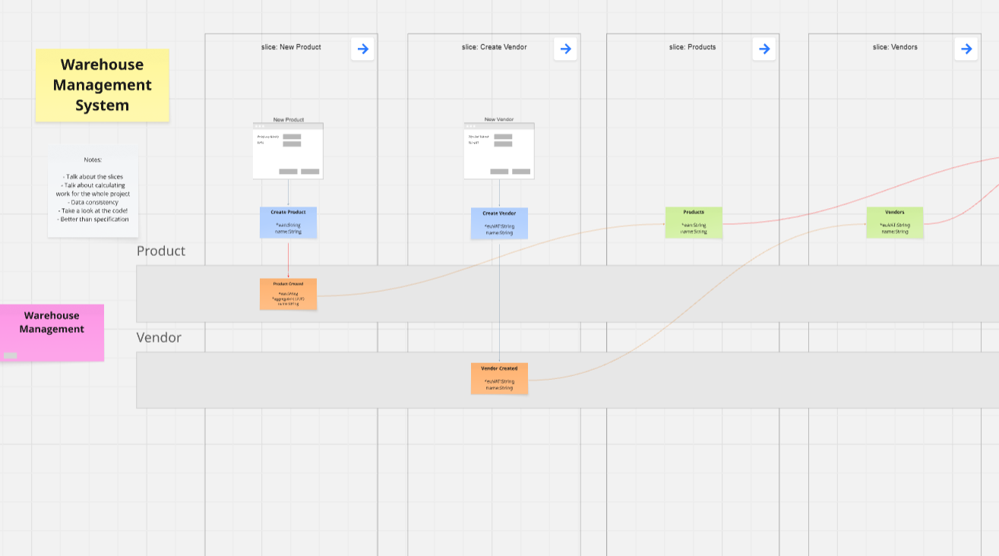

# Warehouse — A Sample Event Modeling Application



A small, self-contained warehouse management app that demonstrates **Event Modeling** and **event sourcing** from the diagram all the way down to a running application — a visual event model, vertical slices, an append-only event store, projections, and a thin HTTP API consumed by a React SPA.

It is designed to be read, not just run: the folder structure mirrors the event model one-to-one, so you can trace every sticky on the board to a file on disk.

---

## What is Event Modeling?

Event Modeling is a visual method for designing information systems by writing down what happens, in order, as a timeline of **commands** (user intent), **events** (immutable facts), and **read models** (the views those facts are projected into). Every feature is captured as one of three kinds of **vertical slice**:


| Slice type       | What it does                                         | Shape                            |
| ---------------- | ---------------------------------------------------- | -------------------------------- |
| **State Change** | Handles a user action, validates rules, emits events | Screen → Command → Event         |
| **State View**   | Projects events into a queryable view for a screen   | Event(s) → Read Model → Screen   |
| **Automation**   | Reacts to state and issues follow-up commands        | Read Model → Processor → Command |


Because the model is executable (each slice has a Given/When/Then specification), the same artifact serves as product spec, architecture, and test plan.

### The Event Model for this project

[See the full Event Model for the Warehouse](#)

A machine-readable export of the model is checked in as `[config.json](./config.json)`, following the [Event Modeling specification](https://github.com/dilgerma/event-modeling-spec). The file `[references/reference_book_concepts.md](./references/reference_book_concepts.md)` summarises the key ideas.

---

## What the app does

A minimal warehouse management scenario:

- **Create products** by EAN and name.
- **Create vendors** by EU VAT and name.
- **Record wholesale purchases** — a vendor delivers a quantity of a product at a given price.
- **Record product sales** — a client buys a quantity of a product at a given sale price.
- **See current inventory** — purchases add, sales subtract.
- **See available products** — products currently in stock, for the sales form.
- **Low Stock automation** — a background processor scans inventory every 10 s and raises a Low Stock Alert for any product that drops below 10 units, which in turn populates the Low Stock Products read model.

All write-side rules (no duplicate EANs, max 1000 units per product, cannot sell more than in stock) live inside aggregates, not controllers. All read-side screens are fed by dedicated projections that are rebuilt from the event log.

---

## Architecture at a glance

```
UI (React SPA)
    │  HTTP
    ▼
API Controllers  ── dispatch ──►  Command Handlers
                                          │
                                          ▼
                                   Aggregates ── emit ──►  Events ──►  Event Store (SQLite)
                                                                              │
                                                                              ▼
                                                                      Projection Background Service
                                                                              │
                                                                              ▼
                                                                        Read Models
                                                                              │
                                                                              ▼
                                                                   Query Handlers ◄── API Controllers
```

- **Event store**: append-only `events` table with per-stream sequence numbers and an optimistic-concurrency `UNIQUE(stream_id, stream_sequence_number)` constraint.
- **Projections**: poll the event log, advance per-projector positions, and write to denormalised SQLite tables.
- **Automations**: hosted background services that read from a projection and issue commands.

### Tech stack


| Layer                     | Choice                                                        |
| ------------------------- | ------------------------------------------------------------- |
| Backend                   | **.NET 10**, ASP.NET Core Web API                             |
| Event store + read models | **SQLite** via `Microsoft.Data.Sqlite` (WAL mode)             |
| Frontend                  | **React 19** + **TypeScript** + **Vite** + React Router       |
| Tests                     | **xUnit**, in-memory `AggregateFixture` / `ProjectionFixture` |


No container runtime, no orchestrator — just two processes.

---

## Prerequisites

- [.NET 10 SDK](https://dotnet.microsoft.com/download)
- [Node.js 20+](https://nodejs.org/) and npm
- (Optional) VS Code with the C# and ESLint extensions

---

## Getting started

Clone the repository, then run the backend and the frontend in two terminals:

```bash
# 1. Backend — REST API on http://localhost:5001
cd warehouse/warehouse.web
dotnet run
```

```bash
# 2. Frontend — SPA on http://localhost:5173
cd warehouse/warehouse.frontend
npm install
npm run dev
```

Open [http://localhost:5173](http://localhost:5173) in your browser.

The first backend run creates `warehouse.db` next to `appsettings.json` and applies all schema scripts from `[warehouse/warehouse.web/Database/init/](./warehouse/warehouse.web/Database/init)`. Subsequent runs reuse the file, so your data persists across restarts.

### VS Code

A compound launch configuration is provided. Open the repo in VS Code, pick **Warehouse (BE + FE)** from the Run & Debug dropdown, and press F5 — this starts the backend (with the debugger attached) and the frontend (in an integrated terminal) at once.

---

## Sample data

The project ships with a `SampleDataSeeder` that creates 3 vendors, 6 products, 8 purchases, and 6 sales — enough to populate every screen including Low Stock Alerts.

By default it is **not** run. To enable it, open `[warehouse/warehouse.web/Program.cs](./warehouse/warehouse.web/Program.cs)` and uncomment the single line under `DatabaseInitializer`:

```csharp
// await app.Services.GetRequiredService<SampleDataSeeder>().ResetAndSeedAsync();
```

Start the app once with the line uncommented — it wipes the DB and repopulates it. Then re-comment the line; subsequent runs leave your data alone.

---

## Running the tests

```bash
cd warehouse
dotnet test
```

Tests live in `[warehouse/warehouse.tests/](./warehouse/warehouse.tests)` and cover aggregates (write-side invariants) and projectors (read-side mapping) in memory. No database is required to run them.

---

## Project layout

```
warehouse/
├── warehouse.web/                # ASP.NET Core backend
│   ├── Api/                      # Thin HTTP controllers, one per feature area
│   ├── Slices/                   # One folder per vertical slice in the Event Model
│   │   ├── NewProduct/           # State Change
│   │   ├── CreateVendor/         # State Change
│   │   ├── CreatePurchase/       # State Change
│   │   ├── Sale/                 # State Change
│   │   ├── LowStockAlert/        # State Change + Automation (polls every 10s)
│   │   ├── Products/             # State View
│   │   ├── Vendors/              # State View
│   │   ├── ProductInventory/     # State View
│   │   ├── AvailableProducts/    # State View (feeds the sales screen)
│   │   ├── InventoryLevels/      # State View (feeds the automation)
│   │   └── LowStockProducts/     # State View
│   ├── EventSourcing/            # Framework: Aggregate, IEventStore, IProjector, …
│   ├── Database/                 # SQLite mechanics + init/*.sql schema scripts
│   ├── Seed/                     # Optional SampleDataSeeder
│   └── Program.cs
├── warehouse.frontend/           # React + Vite SPA
│   └── src/pages/                # One page per screen in the Event Model
└── warehouse.tests/              # xUnit tests
```

Every sticky on the board has a home: commands/events in `Slices/<Slice>/`, aggregates in the State Change slice that creates them, projectors + query handlers in the owning State View slice, SQL tables in `Database/init/`, screens in `warehouse.frontend/src/pages/`.

---

## Further reading

- **Event Modeling specification:** [https://github.com/dilgerma/event-modeling-spec](https://github.com/dilgerma/event-modeling-spec)
- **Reference materials** used while building this project live in `[references/](./references)` — notably the Event Modeling & Event Sourcing book summary and the Axon Framework source used to cross-check the projection/token-store design.
- **My article / talk on this project:** 

---

## License